# AWS_Networking_Implementation (VPC, Subnets, IG, NAT, Routing)
This projects aims at simplifying the complex aspects of AWS networking, highlighting the useful nature of VPC and subnets 

## Amazon VPC
With Amazon Virtual Private Cloud (Amazon VPC), you can launch AWS resources in a logically isolated virtual network that you've defined. This virtual network closely resembles a traditional network that you'd operate in your own data center, with the benefits of using the scalable infrastructure of AWS.
	
### The Default VPC
this is like a starter pack provided by AWS for your cloud services, it is preconfugured in the cloud where you can start deploying applications or services. A default VPC comes with a public subnet in each Availability Zone, an internet gateway, and settings to enable DNS resolution. Therefore, you can immediately start launching Amazon EC2 instances into a default VPC. You can also use services such as Elastic Load Balancing, Amazon RDS, and Amazon EMR in your default VPC.
### Creating a new VPC
Open the Amazon VPC console at https://console.aws.amazon.com/vpc/, and on the VPC dashboard, choose Create VPC we enter `first-vpc` as the name and `"10.0.0.0/16"` as the IPv4 CIDR and proceed to `CREATE VPC` 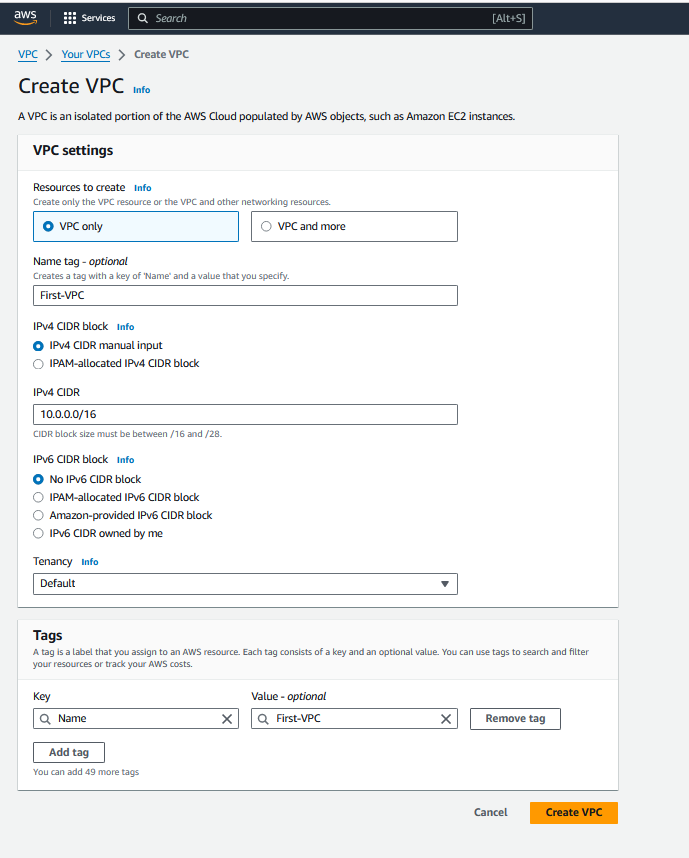
As soon as the VPC is created it is assigned a vpc-id and there is a route table created that serves as the main route table as shown below 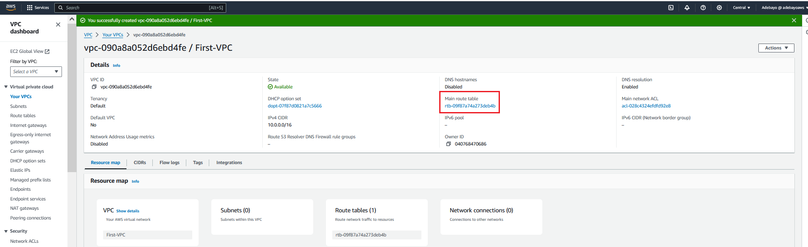
### Creating and Configuring Subnets
SUBNETS: are smaller segments within the VPC that helps manage and organize your resources 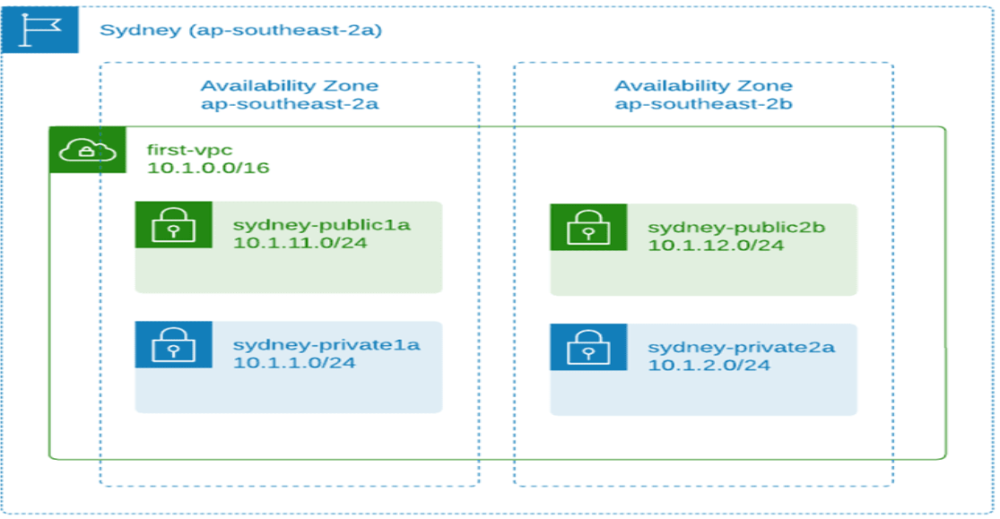
we then proceed the the VPC page and select `subnets` in the sidebar, we then proceed to create the following subnets 

- subnet-public1a   (avaibalility zone)     10.0.11.0/24
- subnet-public2b   (avaibalility zone)     10.0.12.0/24
- subnet-private1a   (avaibalility zone)     10.0.1.0/24
- subnet-private2b   (avaibalility zone)     10.0.2.0/24

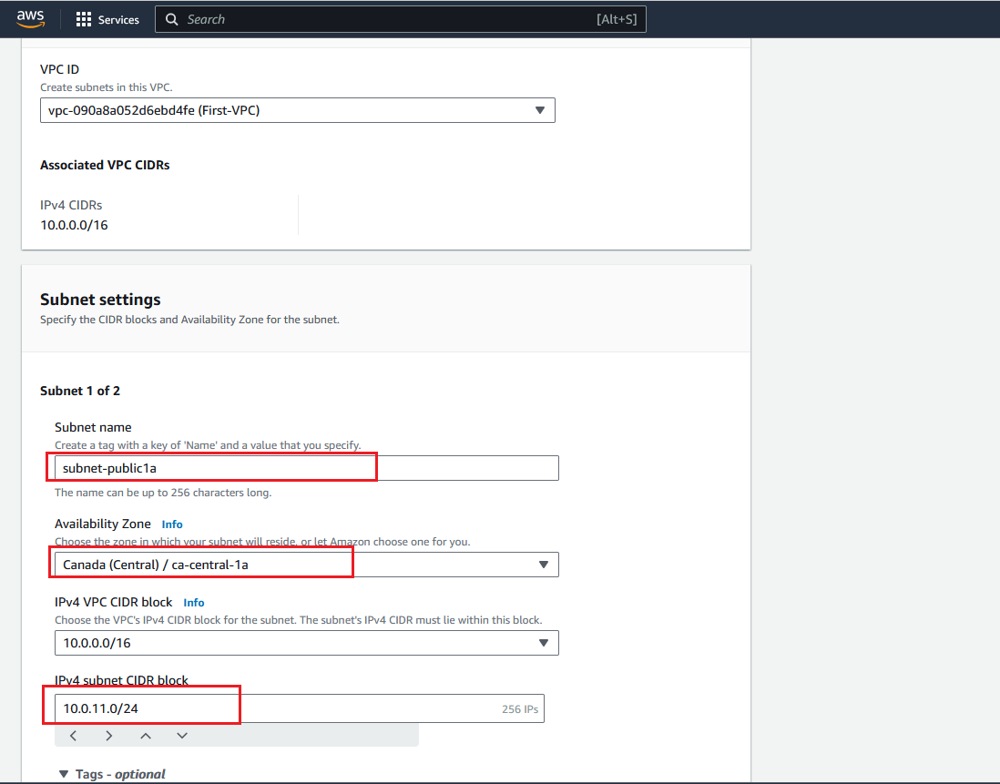 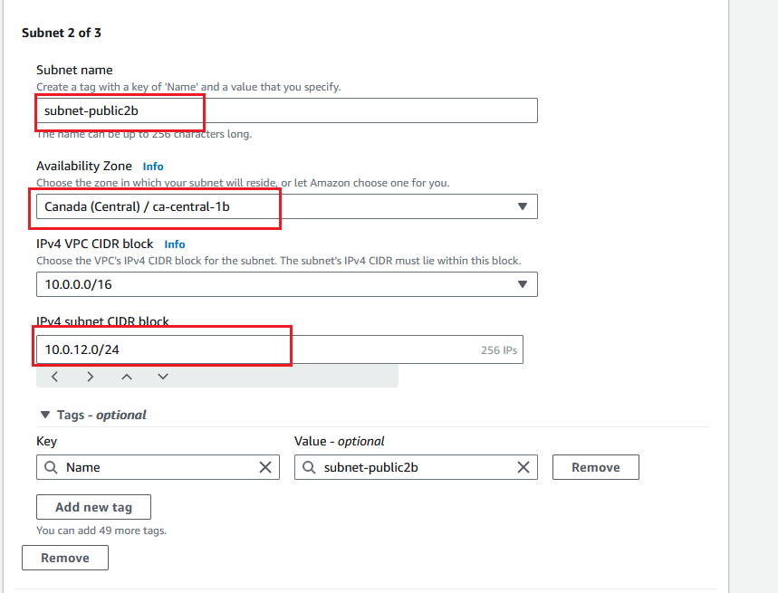 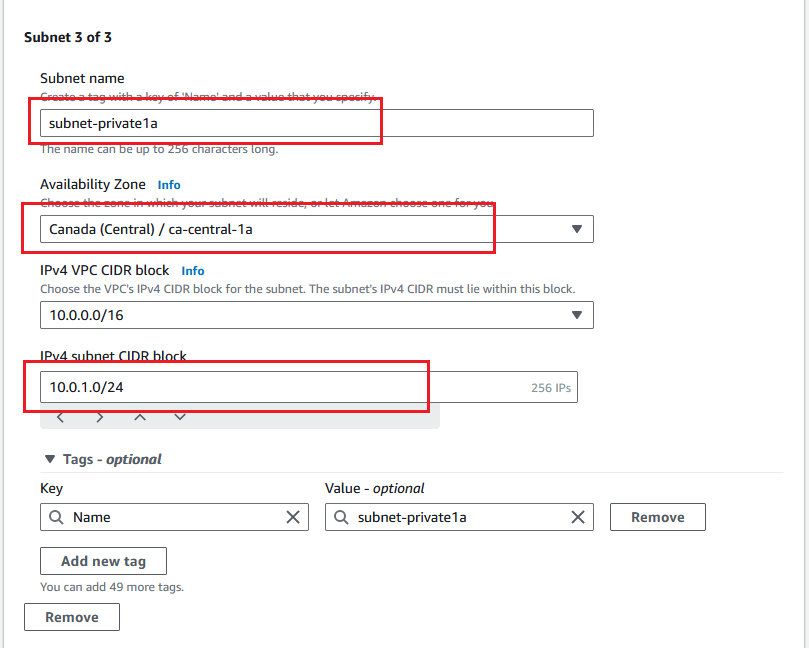 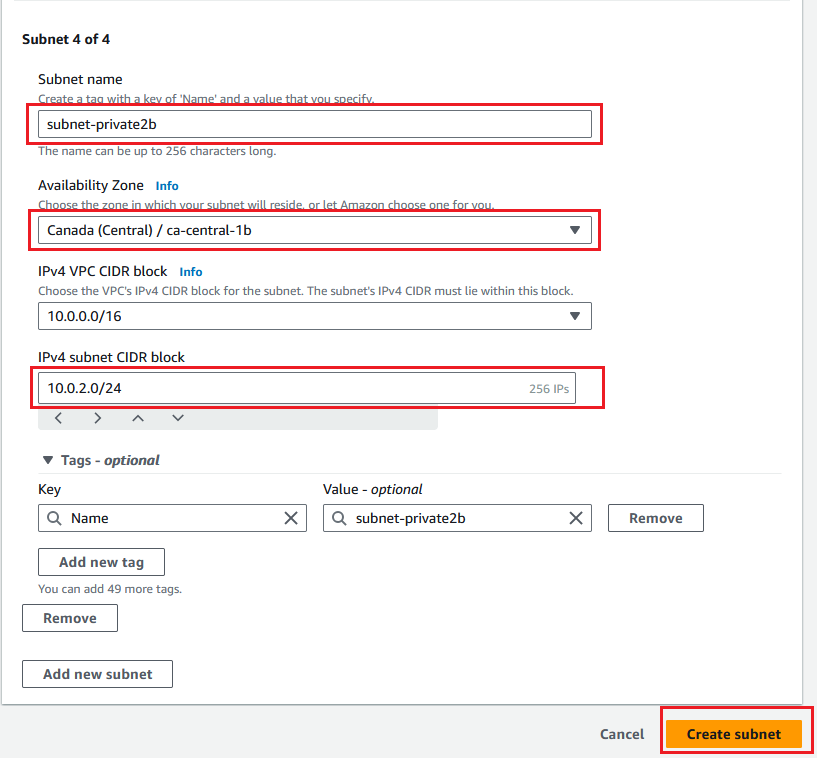
we the click `create` as of now you can deploy EC2 instances into the VPC by selecting one of the subnets but the public subnet doenst have any internet access at this stage 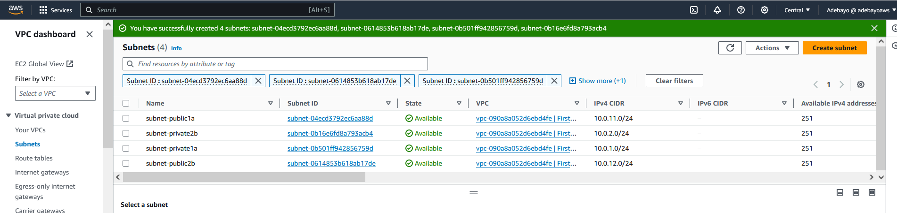
### Understanding public and private Subnets in AWS VPC
Public Subnet: A public subnet is a subnet in your VPC that has a direct route to the internet via an Internet Gateway (IGW). Resources launched in a public subnet have a public IP address and can communicate with the internet directly. Public subnets are typically used for resources that need to be accessed from the internet, such as web servers or load balancers.

Private Subnet: A private subnet is a subnet in your VPC that does not have a direct route to the internet. Resources launched in a private subnet do not have a public IP address and cannot communicate with the internet directly. However, they can communicate with resources in other subnets within the same VPC or with other networks connected to your VPC using a Virtual Private Network (VPN) or AWS Direct Connect. Private subnets are typically used for resources that do not need to be accessed from the internet, such as databases or application servers.

Advantages of using Public and Private Subnets: The use of public and private subnets in a VPC provides several benefits, such as:

1. Security: By using public and private subnets, you can create a layered security model to protect your resources. Public subnets are exposed to the internet and are more vulnerable to attacks, while private subnets are isolated and less exposed to external threats.
2. Cost Optimization: Using public and private subnets can help optimize costs. For example, you can launch resources that need to be accessed from the internet in a public subnet and resources that do not need to be accessed from the internet in a private subnet. This way, you can avoid unnecessary charges for data transfer and reduce your overall costs.
3. Scalability: Public and private subnets allow you to scale your resources in a VPC more efficiently. You can launch new resources in either public or private subnets and connect them to other resources within the VPC or external networks using VPN or Direct Connect.

## Internet Gateway and Routing Table
### what is an internet gateway: 
An Internet Gateway (IGW) is an AWS component that provides a path for network traffic to travel between a Virtual Private Cloud (VPC) and the public internet. It acts as a bridge between the two networks, enabling inbound and outbound connections from resources within the VPC.
#### Public Subnets
technically the subnets are still private you will need to make it work as a public subnet 
- an Internet Gateway (IGW) attached to the VPC
- Route table with default route towards the IGW
- Public IP assigned to the AWS resources (eg. EC2 instance)
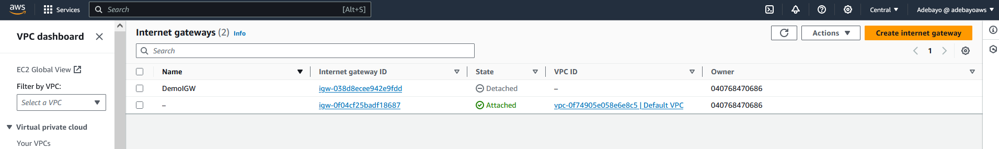
we then proceed to create an IGW and click on attach to VPC on the `action` botton
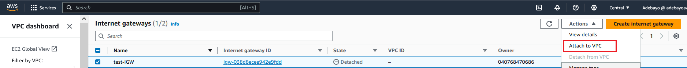
we then attach it to the `first-vpc` 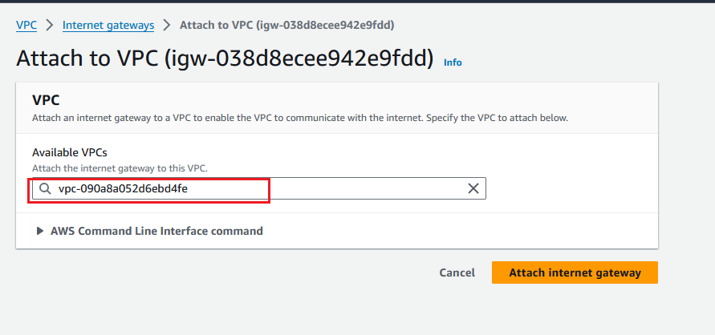 we want the private subnets to be private, we dont want them to have a default route to the internet, for that we need to create a separate route table for the public subnets.
### what is a routing table in aws
A route table contains a set of rules, called routes, that determine where network traffic from your subnet or gateway is directed.
Now that we have our entrance and exit (IGW) we need to have directions to our recources. we thus select `route table` on the sidebar menue of the VPC page, and we click on `create route table` we then name the route table ` test-vpc-public-rtb` and select the desired VPC `First-vpc`
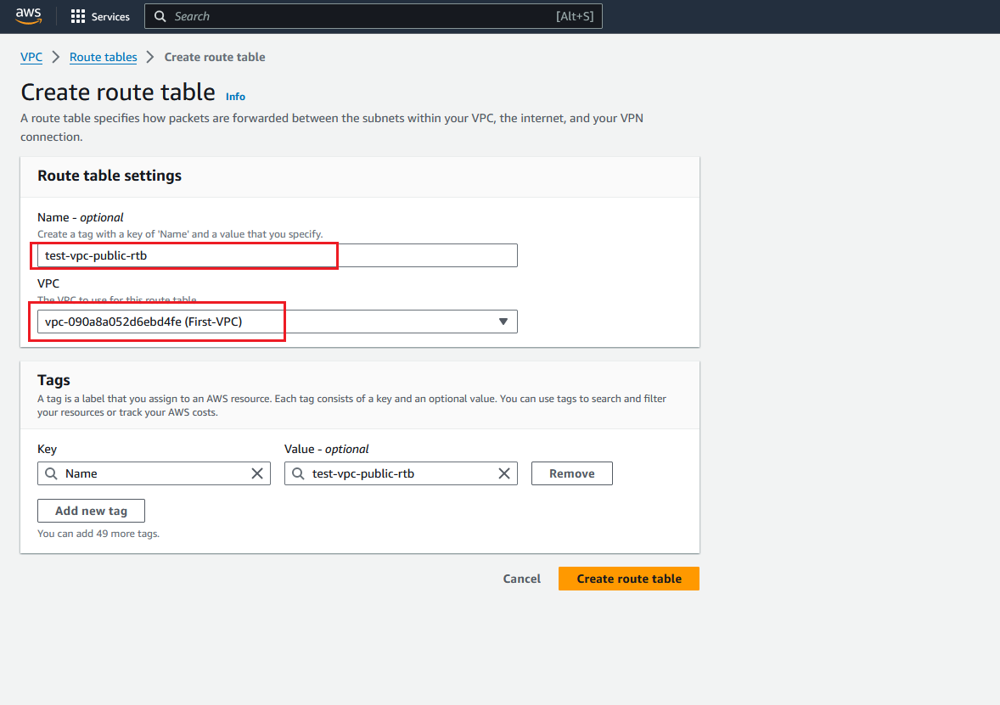 once created, edit the route table, add a default route to the IGW 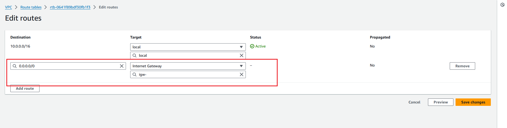 and select the internet gateway 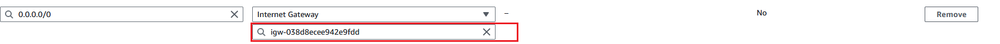
Next go to `subnet associations` tab and click `edit associations1` 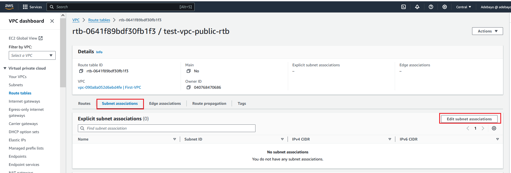 we then select the public subnets and save associations
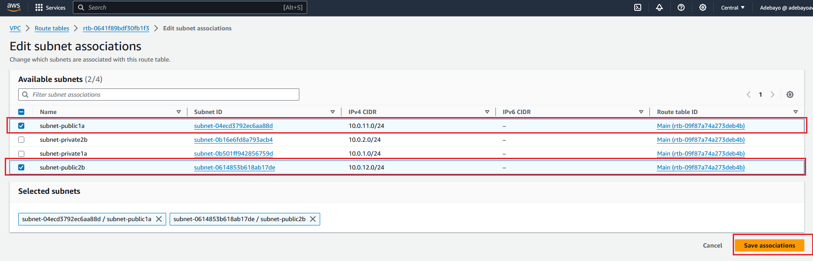
that is it, now an EC2 instance in the public subnet can have access to the internet.

## NAT Gateway and Private Subnets
A NAT gateway is a Network Address Translation (NAT) service. You can use a NAT gateway so that instances in a private subnet can connect to services outside your VPC but external services cannot initiate a connection with those instances.

When you create a NAT gateway, you specify one of the following connectivity types:

Public – (Default) Instances in private subnets can connect to the internet through a public NAT gateway, but cannot receive unsolicited inbound connections from the internet. You create a public NAT gateway in a public subnet and must associate an elastic IP address with the NAT gateway at creation. You route traffic from the NAT gateway to the internet gateway for the VPC. Alternatively, you can use a public NAT gateway to connect to other VPCs or your on-premises network. In this case, you route traffic from the NAT gateway through a transit gateway or a virtual private gateway.

Private – Instances in private subnets can connect to other VPCs or your on-premises network through a private NAT gateway. You can route traffic from the NAT gateway through a transit gateway or a virtual private gateway. You cannot associate an elastic IP address with a private NAT gateway. You can attach an internet gateway to a VPC with a private NAT gateway, but if you route traffic from the private NAT gateway to the internet gateway, the internet gateway drops the traffic.
### Creating a NAT gateway and Linking it to a Private Subnet
we go to VPC -> NAT Gateways and click create NAT Gateway, we name it `test-nat` under one of the subnet is chose the subnet `subnet-private2b` we also need to alocate elastic IP because this is required for the creation of NAT Gateway we then proceed to create.
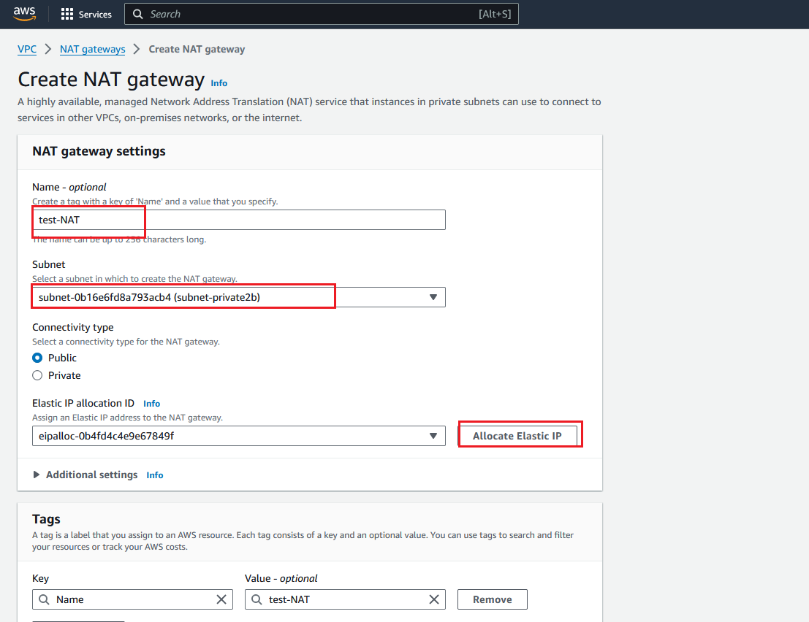
we then go to the route table menu and create a route table for private subnets as shown below 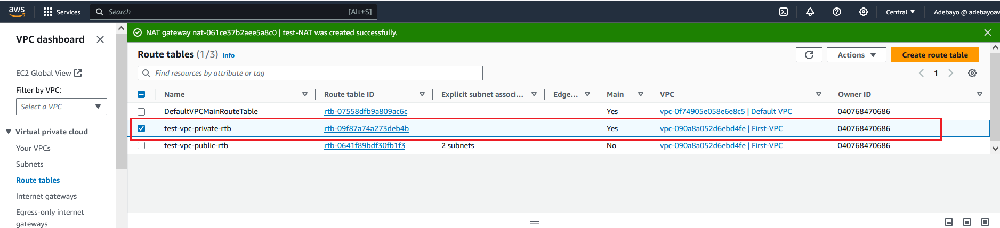 
we chose the private route table and select `routes` tab, and select add route. under target select the NAT Gateway named `test-nat` 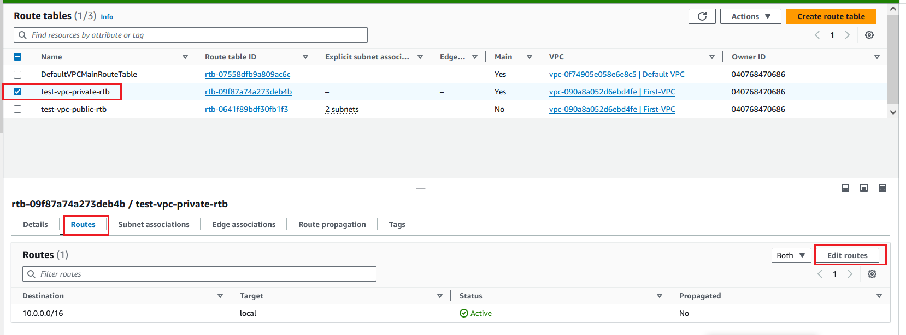 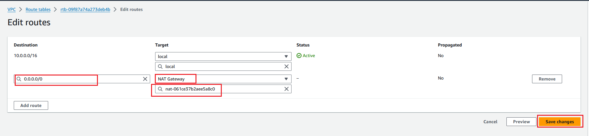
Next we go to `subnet associations` and click `edit subnet associations` 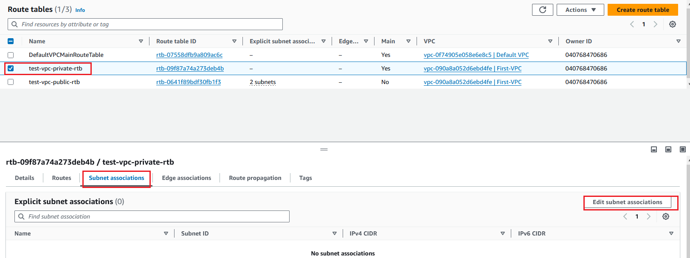 we selcet the private subnets and save.

## Security Group and Network ACLs
### Understanding the difference between Security Group and Network Access Control List
Security groups and network ACLs are similar in that they allow you to control access to AWS resources within your VPC. But security groups allow you to control inbound and outbound traffic at the instance level, while network ACLs offer similar capabilities at the VPC subnet level. 
A security group is like a virtual firewall for your EC2 instances. It provides security at the protocol and port access level. You can specify which protocols and ports are allowed for inbound and outbound traffic. By default, security groups allow all outbound traffic and no inbound traffic, unless you add rules to allow specific traffic. When you launch an instance, you can specify one or more security groups. You can also add or remove rules from a security group at any time.

A network access control list (ACL) is an optional layer of security for your VPC that acts as a firewall for controlling traffic in and out of one or more subnets. You can create a network ACL and associate it with a subnet. You add rules to each network ACL to allow or deny traffic. Inbound and outbound traffic is allowed or denied by default.

Security groups and network ACLs both provide security at the network layer, but they differ in the following ways:

• A security group is associated with an EC2 instance, whereas a network ACL is associated with a subnet.

• You can modify the rules for a security group at any time; you can’t modify the rules for a network ACL until you disassociate it from the subnet.

• Security groups are stateful; network ACLs are stateless. This means that if you allow traffic in one direction, traffic is allowed in the other direction also. With a network ACL, you must explicitly allow traffic in both directions.

• You can’t block specific IP addresses using a security group; you can block specific IP addresses using a network ACL.

## VPC Peering and VPN Connection
A VPC peering connection is a networking connection between two VPCs that enables you to route traffic between them using private IPv4 addresses or IPv6 addresses. Instances in either VPC can communicate with each other as if they are within the same network. You can create a VPC peering connection between your own VPCs, or with a VPC in another AWS account. The VPCs can be in different Regions (also known as an inter-Region VPC peering connection).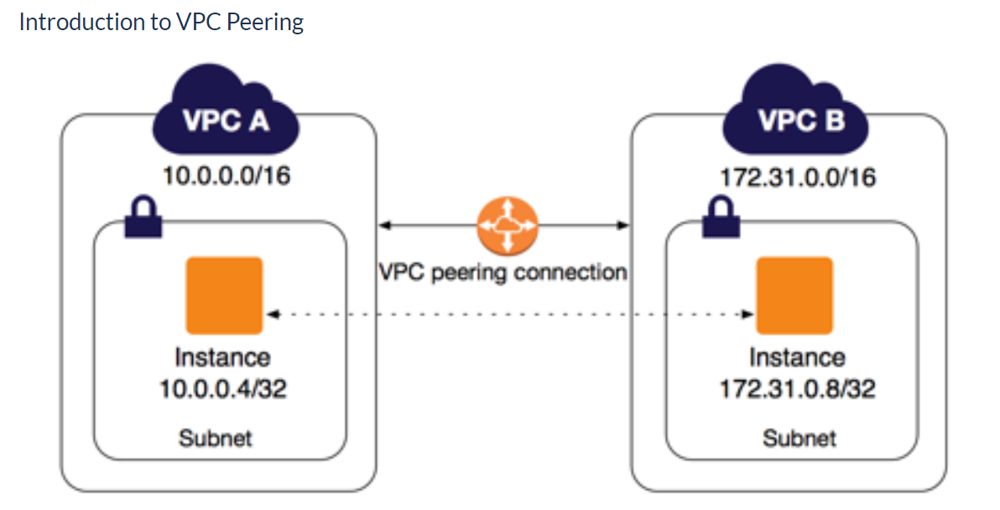

A VPN, which stands for virtual private network, establishes a digital connection between your computer and a remote server owned by a VPN provider, creating a point-to-point tunnel that encrypts your personal data, masks your IP address, and lets you sidestep website blocks and firewalls on the internet.
 there are 2 types: 
1. **A site-to-site virtual private network (VPN)**: refers to a connection set up between multiple networks. This could be a corporate network where multiple offices work in conjunction with each other or a branch office network with a central office and multiple branch locations or a cloud provider. 
2. **AWS Client VPN**: Provides secure remote access to the cloud network for individual users or devices it enables secure connectivity for remote employees, partners, or contractors to access recources in the VPC securely. 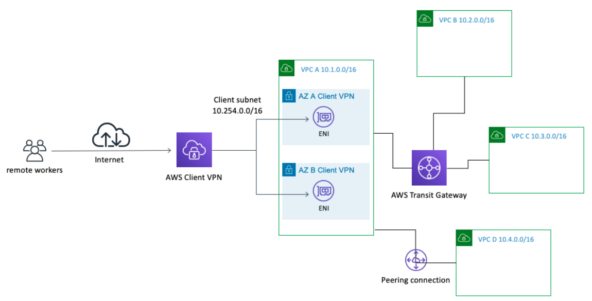

